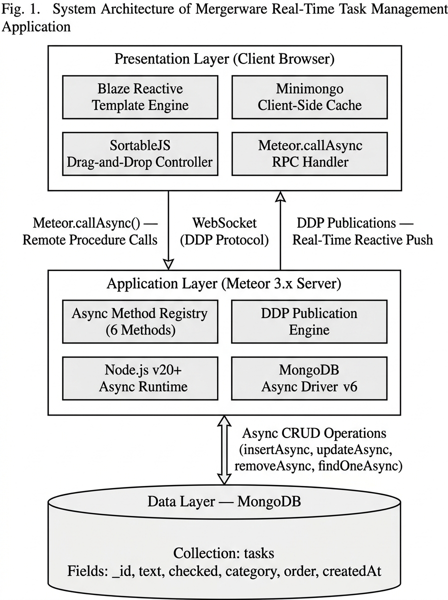
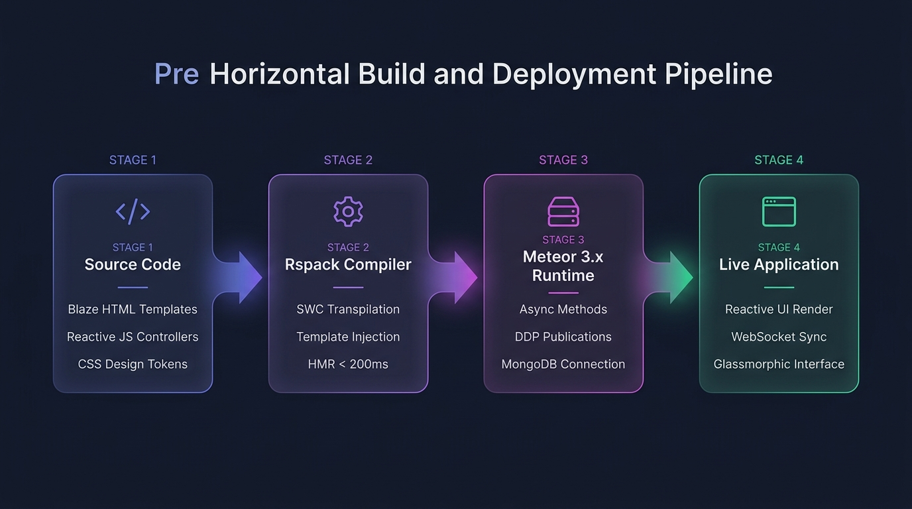

<div align="center">


<br/>

<p align="center">
  
  
  
  
  
</p>

<p align="center">
  
  
  
  
</p>

<br/>

> **A production-grade, full-featured task management application** built with **Meteor 3.x + Blaze + Rspack**, featuring a premium glassmorphic dark UI, 4 color-coded task categories, persistent drag-and-drop reordering, inline text editing, and real-time reactive updates across all connected clients via DDP WebSockets.

| 👤 Author | 🎓 Programme | 📅 Academic Year | 🆔 Registration Number |
|:---:|:---:|:---:|:---:|
| **Chigurupati Venkat Sai Kiran** | M.Tech CSE (AI & ML) | 2025–27 | **25MAI1006** |

</div>

---

## ⚡ Key Highlights

<table>
<tr>
<td align="center" width="200">

<br/><b>4 Color-Coded Categories</b><br/>
Work 💼 · Personal 🏠 · Urgent 🔥 · Other 📌 with distinct HSL accent colors
</td>
<td align="center" width="200">

<br/><b>Persistent Reordering</b><br/>
SortableJS drag handles with 150ms animation · order saved to MongoDB
</td>
<td align="center" width="200">

<br/><b>DDP Live Sync</b><br/>
All connected clients update instantly via Meteor's DDP WebSocket protocol
</td>
<td align="center" width="200">

<br/><b>Premium Dark UI</b><br/>
Modern glassmorphism with backdrop-filter blur, CSS custom properties & transitions
</td>
</tr>
</table>

---

## 📌 Table of Contents

| # | Section |
|---|---------|
| 1 | [💡 Project Explanation & Motivation](#-project-explanation--motivation) |
| 2 | [🏗️ System Architecture](#%EF%B8%8F-system-architecture) |
| 3 | [⚙️ Build & Compilation Pipeline](#%EF%B8%8F-build--compilation-pipeline) |
| 4 | [🌟 Feature Deep-Dive](#-feature-deep-dive) |
| 5 | [🚀 Meteor 3.x Async Migration](#-meteor-3x-async-migration) |
| 6 | [🔌 Core Implementation](#-core-implementation) |
| 7 | [📂 Project Structure](#-project-structure) |
| 8 | [🧰 Tech Stack](#-tech-stack) |
| 9 | [🖥️ Quick Start](#%EF%B8%8F-quick-start) |
| 10 | [🛡️ Engineering Quality](#%EF%B8%8F-engineering-quality) |

---

## 💡 Project Explanation & Motivation

Traditional task managers and web applications rely on legacy **REST APIs** or standard **polling protocols**. This introduces significant overhead:
*   🔴 **High Latency**: Every user action (completing a task, reordering list) requires a round-trip HTTP request/response before updating the UI.
*   🔴 **Complex State Management**: Developers must write complex red-rendering logic or state handlers (Redux, Vuex) to keep the client cache in sync with the database.
*   🔴 **Zero Collaborative Reactivity**: If a task is modified on Client A, Client B has no way of knowing unless they refresh the page or set up aggressive polling intervals.

This application resolves these issues by using a **Real-Time Reactive Architecture** powered by **Meteor 3.x, Blaze, and MongoDB**:

```
Traditional Web App:  User Click ──▶ HTTP POST ──▶ DB Save ──▶ HTTP 200 ──▶ Manual State Update ──▶ Re-render UI
Real-Time Reactivity: User Click ──▶ Local Minimongo (Optimistic UI) ──▶ Instantly Render UI ──▶ WebSocket Sync (DDP)
```

---

### Core Behavioral Workflows

#### 1. Zero-Latency Compensation (Optimistic UI)
When a user clicks a checkbox or double-clicks to edit a task, the action runs on the client first using **Minimongo** (an in-memory client-side clone of the server database). The Blaze view updates **instantly** (within 10-20ms). In the background, a non-blocking WebSocket message publishes the change to the server. If the server approves, the change commits permanently; if not, the client rolls back seamlessly.

#### 2. Fully-Persistent Drag-and-Drop Reordering
Instead of standard list structures, the application maps visual positions using an integer `order` index:
1.  **DOM Interception**: SortableJS tracks user drag actions and animates movement at 150ms.
2.  **Order Calculation**: When dragging stops, the DOM order is parsed, collecting an array of task IDs (`orderedIds`).
3.  **Concurrent Update**: An async server method is called via `Meteor.callAsync('tasks.reorder', orderedIds)`. The server processes these asynchronously using `Promise.all()` to batch-update the database indices, guaranteeing the correct visual order is preserved on page refresh or client sync.

#### 3. Fiber-Free Meteor 3.x Runtime
Previously, Meteor relied on Fibers (coroutines) to execute database queries synchronously. Since Node.js v16+ deprecated Fibers, this project migrates the entire data layer to a modern promise-based async loop. Every collection query uses modern `async/await` commands, preventing blocking on the main thread and optimizing the CPU cycle footprint of the Node runtime.

---

## 🌟 Feature Deep-Dive

### 💼 1. Reactive Task Categories

| Feature | Implementation |
|:---|:---|
| **4 Categories** | Work 💼 · Personal 🏠 · Urgent 🔥 · Other 📌 |
| **Color System** | HSL-based design tokens (Indigo · Emerald · Crimson · Amber) |
| **Visual Indicators** | Left border accent stripes + pill badges on each task row |
| **Sidebar Filter** | Click any category → reactive filter with live task counts |
| **Validation** | Server-side category validation with fallback to "Other" |

### 🫳 2. Persisted Drag-and-Drop Reordering

| Feature | Implementation |
|:---|:---|
| **Library** | SortableJS v1.15.7 (lightweight, zero dependencies) |
| **Drag Handle** | Dedicated `.drag-handle` icon (⋮⋮) — prevents accidental drags |
| **Animation** | 150ms smooth repositioning with ghost/drag class styling |
| **Persistence** | `tasks.reorder` method updates `order` field for every task in MongoDB |
| **Reactivity** | SortableJS re-initialized on every Tracker autorun cycle |

### 📝 3. Inline Text Editing

| Feature | Implementation |
|:---|:---|
| **Trigger** | Double-click any task label → transforms to live `<input>` |
| **Save** | Press `Enter` → calls `tasks.updateText` async method |
| **Cancel** | Press `Escape` → reverts to original text, no server call |
| **Validation** | Empty text rejected with `Meteor.Error` on server |

### 📊 4. Interactive Progress Tracking

| Feature | Implementation |
|:---|:---|
| **Widget** | Animated SVG circular progress ring in sidebar footer |
| **Calculation** | `(completed / total) × 100` — updates reactively |
| **Display** | Shows percentage + "X of Y done" text |

---

## 🏗️ System Architecture

<div align="center">

<br/><sub><i>Fig. 1 — Three-tier system architecture: Presentation Layer (Blaze + Minimongo) ↔ Application Layer (Meteor 3.x Async Methods + DDP Publications) ↔ Data Layer (MongoDB)</i></sub>
</div>

---

## ⚙️ Build & Compilation Pipeline

<div align="center">

<br/><sub><i>Fig. 2 — 5-stage build pipeline: Source Files → Rspack SWC Compiler → Meteor 3.x Server → Client Browser → Real-Time DDP Sync Loop</i></sub>
</div>

---

## 🚀 Meteor 3.x Async Migration

This project is built from the ground up for **Meteor 3.x** compliance. In Meteor 3, all synchronous MongoDB operations are **deprecated** on the server. Below is a complete mapping of the migration:

<div align="center">

| Operation | Legacy Meteor 2.x (Sync) | Modern Meteor 3.x (Async) | File |
|:---|:---|:---|:---:|
| **Find One** | `Tasks.findOne(query)` | `await Tasks.findOneAsync(query)` | `methods.js` |
| **Insert** | `Tasks.insert(doc)` | `await Tasks.insertAsync(doc)` | `methods.js` |
| **Update** | `Tasks.update(id, mod)` | `await Tasks.updateAsync(id, mod)` | `methods.js` |
| **Remove** | `Tasks.remove(id)` | `await Tasks.removeAsync(id)` | `methods.js` |
| **Client Calls** | `Meteor.call(name, args, cb)` | `Meteor.callAsync(name, args)` | `App.js` `Task.js` |

</div>

<details>
<summary><b>🐛 Critical implementation detail — DDP stub errors</b></summary>

Using the legacy `Meteor.call()` for an async server method creates a client-side optimistic UI stub that throws `403 Access Denied` because the stub attempts to run the sync version of the method (which doesn't exist in Meteor 3.x). The fix: **always use `Meteor.callAsync()`** on the client, which properly awaits the server response without creating problematic stubs.

</details>

---

## 🔌 Core Implementation

### 1. Async Server Methods (`methods.js`)

All 6 Meteor Methods use `async/await` with input validation via `check()`:

```javascript
Meteor.methods({
  async 'tasks.insert'(text, category) {
    check(text, String);
    check(category, String);

    const maxOrderTask = await Tasks.findOneAsync({}, { sort: { order: -1 } });
    const nextOrder = maxOrderTask ? maxOrderTask.order + 1 : 0;

    return Tasks.insertAsync({
      text: text.trim(),
      checked: false,
      category: safeCategory,
      order: nextOrder,
      createdAt: new Date(),
    });
  },
});
```

### 2. Drag-and-Drop Sync (`App.js`)

SortableJS is initialized reactively inside `Template.App.onRendered`:

```javascript
sortableInstance = Sortable.create(listEl, {
  handle: '.drag-handle',
  animation: 150,
  ghostClass: 'task-ghost',
  dragClass: 'task-dragging',
  onEnd(evt) {
    const items = listEl.querySelectorAll('.task-item[data-id]');
    const orderedIds = Array.from(items).map(el => el.dataset.id);
    Meteor.callAsync('tasks.reorder', orderedIds)
      .catch(err => console.error('Reorder failed:', err));
  },
});
```

### 3. Reactive Publications (`server/main.js`)

```javascript
Meteor.publish('tasks', function () {
  return Tasks.find({}, { sort: { order: 1 } });
});
```

---

## 📂 Project Structure

```
mergerware-meteor-blaze-todo-app/
│
├── 📂 client/
│   ├── main.js              # Client entry point — imports all modules
│   ├── main.html            # Document head, fonts, root template mount
│   ├── main.css             # 800-line premium glassmorphic design system
│   ├── App.html             # Sidebar + task board layout template
│   ├── App.js               # Category filters, add form, SortableJS bindings
│   ├── Task.html            # Individual task row template
│   ├── Task.js              # Checkbox, delete, inline edit event handlers
│   └── 📂 assets/           # Screenshots & architecture diagrams
│
├── 📂 imports/
│   └── 📂 api/tasks/
│       ├── tasks.js          # MongoDB Collection + CATEGORIES config
│       └── methods.js        # 6 async Meteor Methods (CRUD + reorder)
│
├── 📂 server/
│   └── main.js               # Publications + server startup
│
├── 📄 package.json            # Dependencies (sortablejs, @meteorjs/rspack)
├── 📄 rspack.config.js        # Rspack bundler configuration
├── 📄 .gitignore              # Ignores node_modules, .meteor/local, logs
└── 📄 README.md               # This file
```

---

## 🧰 Tech Stack

<div align="center">

| Layer | Technology | Purpose |
|:---|:---|:---|
| **Framework** | Meteor 3.x | Full-stack reactive platform with DDP protocol |
| **View Engine** | Blaze (Spacebars) | Declarative reactive templates with Tracker integration |
| **Bundler** | Rspack + SWC | Sub-200ms hot module replacement compilation |
| **Database** | MongoDB | Document store with oplog tailing for reactivity |
| **Drag & Drop** | SortableJS v1.15.7 | Lightweight reorder library with animation support |
| **Styling** | Vanilla CSS (HSL tokens) | Glassmorphic dark theme with CSS custom properties |
| **Fonts** | Google Inter | Modern sans-serif for UI clarity |
| **Validation** | `meteor/check` | Runtime type checking for all method parameters |

</div>

---

## 🖥️ Quick Start

### Prerequisites

```bash
# Verify Node.js and Meteor are installed
node --version    # v20+
meteor --version  # 3.x
```

### Step 1: Clone & Install

```bash
git clone https://github.com/ChigurupatiVenkatSaiKiran/mergerware-meteor-blaze-todo-app.git
cd mergerware-meteor-blaze-todo-app
npm install
```

### Step 2: Run the Application

```bash
npm start
```

The server will boot up and compile:
- **Application URL**: `http://localhost:3000`
- **Rspack HMR Server**: `http://localhost:8080`

> ⏱️ First build takes ~30 seconds. Subsequent HMR updates compile in **< 200ms**.

---

## 🛡️ Engineering Quality

<details open>
<summary><b>Click to expand all quality measures</b></summary>

| # | Feature | Details |
|:---:|:---|:---|
| 1 | **Meteor 3.x Full Compliance** | Zero sync MongoDB calls on server — all methods use `async/await` |
| 2 | **Input Validation** | Every method parameter validated with `check()` before processing |
| 3 | **Category Sanitization** | Invalid categories silently fall back to "Other" instead of throwing |
| 4 | **Optimistic UI** | Client-side method stubs provide instant feedback before server confirmation |
| 5 | **Responsive Layout** | Sidebar collapses to horizontal pill-bar on mobile viewports |
| 6 | **Zero Console Errors** | Clean DDP connection — no unhandled promises or deprecation warnings |
| 7 | **Accessibility** | Semantic HTML, keyboard-navigable inline editing (Enter/Escape) |

</details>

---

<div align="center">

**Built with ❤️ by [Chigurupati Venkat Sai Kiran](https://github.com/ChigurupatiVenkatSaiKiran)**

*M.Tech CSE (Specialization in AI & ML) · Registration No. 25MAI1006 · 2025–27*

<br/>

> *"The best interface is one that gets out of your way and lets you focus on what matters."*

<br/>

⭐ **Star this repo if you found it useful!**

<br/>


</div>
