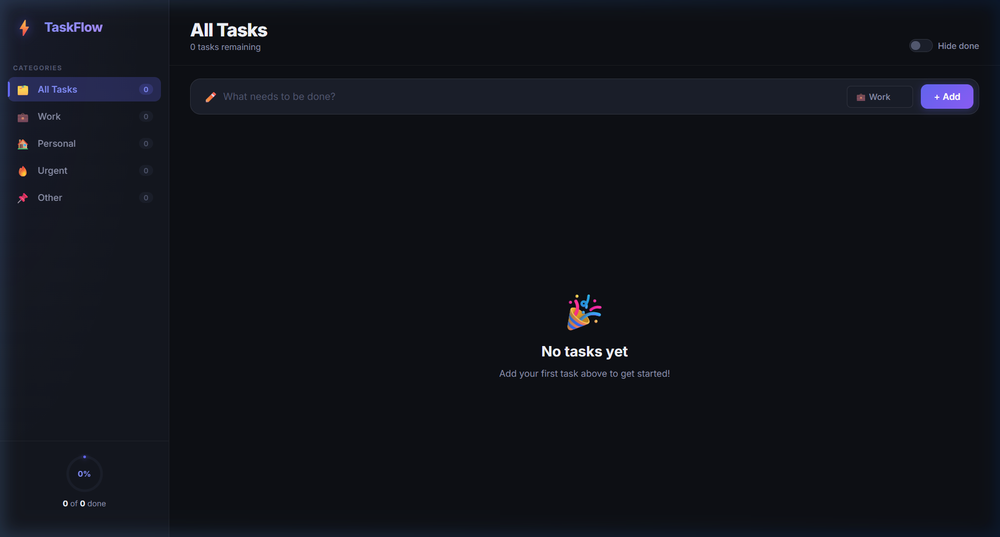
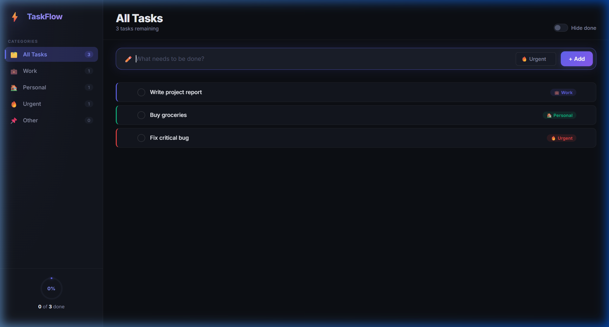
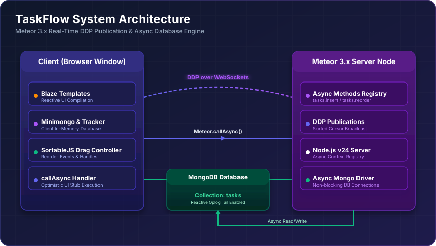
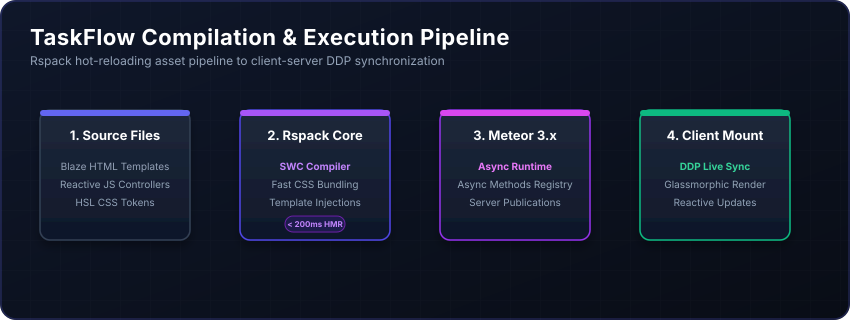

# <div align="center">⚡ Mergerware Meteor Blaze Todo App</div>

<div align="center">

**A Premium, State-of-the-Art Task Management System built with Meteor 3.x, Blaze & Rspack.**

*This application goes far beyond a typical to-do application, presenting an ultra-modern glassmorphic interface, real-time reactive counts, fully-persistent drag-and-drop reordering, inline text editing, and complete mobile responsiveness.*

---

[](https://meteor.com)
[](https://blazejs.org)
[](https://rspack.dev)
[](https://mongodb.com)
[](https://github.com)

</div>

---

## 🎨 Visual Showcases

### 💻 1. Main Dashboard (Empty State)
A polished onboarding card with floating emojis and clean copy that prompts users to create their first tasks.


### 📋 2. Active Todo Board (Glassmorphic Interface)
A dual-panel layout containing a dynamic left sidebar for completion statistics, active filters, and real-time task counts, alongside a main task board showing category-coded items.


---

## 📖 Table of Contents
1. [🌟 Key Features & UX Enhancements](#-key-features--ux-enhancements)
2. [🏗️ Technical Architecture & Specs](#%EF%B8%8F-technical-architecture--specs)
3. [🚀 Meteor 3.x Migration Guide (Sync-to-Async)](#-meteor-3x-migration-guide-sync-to-async)
4. [📂 Code Directory Map](#-code-directory-map)
5. [🔌 Core Implementation Snippets](#-core-implementation-snippets)
6. [🖥️ Quick Start & Setup](#%EF%B8%8F-quick-start--setup)
7. [🛠️ Verification & Quality Assurance](#%EF%B8%8F-verification--quality-assurance)

---

## 🌟 Key Features & UX Enhancements

### 💼 Reactive Task Categories
*   **4 Default Categories**: Work 💼, Personal 🏠, Urgent 🔥, and Other 📌.
*   **Color Systems**: Built on HSL color systems. Every category is assigned unique color tokens (Indigo, Emerald, Crimson, Amber) used for item borders, glow shadows, and tag badges.
*   **Sidebar Filter Badges**: Sidebar filter links dynamically calculate and render item tallies reactively based on active filters.

### 🫳 Persisted Drag-and-Drop Reordering
*   **SortableJS Core**: Integration of lightweight SortableJS (v1.15.7) for drag animation performance.
*   **Drag Handle Constraints**: An explicit handle icon (`drag-handle`) ensures drag gestures do not interfere with checkboxes or text fields.
*   **Database Sync**: Automatically updates the `order` fields in MongoDB using non-blocking promises on event completion.

### 📝 In-Place Inline Text Editing
*   **Trigger**: Double-clicking a task's title instantly swaps the static text with an editing input.
*   **Keys**: Event listeners catch `Enter` to commit, and `Escape` to discard changes without server roundtrips.

### 📊 Interactive Progress Tracking
*   **SVG Gauge**: An animated circular SVG progress widget in the sidebar footer showing your real-time task completion percentage.

---
## 🏗️ Technical Architecture & Pipeline

### 🌐 System Architecture
The application runs on a reactive distributed state model. Client UI interactions trigger optimistic UI updates in the local `Minimongo` database, while non-blocking asynchronous WebSocket DDP messages sync the state to the server and the primary MongoDB instance.



### ⚙️ Compilation & Asset Pipeline
With Rspack as the core compiler, code modifications (CSS, templates, and server methods) undergo HMR (Hot Module Replacement) and compilation in less than 200ms.




## 🚀 Meteor 3.x Migration Guide (Sync-to-Async)

This project is developed from the ground up to be compliant with **Meteor 3.x**. In Meteor 3, synchronous MongoDB operations are deprecated on the server. Below is a summary of how this project implements these upgrades:

| Feature / Operation | Legacy Meteor 2.x (Sync) | Modern Meteor 3.x (Async) |
| :--- | :--- | :--- |
| **Server Fetch** | `Tasks.findOne(query)` | `await Tasks.findOneAsync(query)` |
| **Server Insert** | `Tasks.insert(doc)` | `await Tasks.insertAsync(doc)` |
| **Server Update** | `Tasks.update(id, modifier)` | `await Tasks.updateAsync(id, modifier)` |
| **Server Delete** | `Tasks.remove(id)` | `await Tasks.removeAsync(id)` |
| **Client Method Calls** | `Meteor.call(name, args, cb)` | `Meteor.callAsync(name, args)` |

---

## 📂 Code Directory Map

```
mergerware-meteor-blaze-todo-app/
├── client/
│   ├── main.js             # Client entry point; mounts templates
│   ├── main.html           # Document wrapper loading web fonts
│   ├── main.css            # Dark mode glassmorphic variables & components
│   ├── App.html            # Main UI layout template
│   ├── App.js              # Template state helpers, filters, SortableJS setup
│   ├── Task.html           # Individual task line template
│   ├── Task.js             # Inline edit inputs, toggle/delete click methods
│   └── assets/             # Screenshots and visual design assets
│
├── imports/
│   └── api/tasks/
│       ├── tasks.js        # Tasks collection definition & Categories schemas
│       └── methods.js      # Meteor 3.x async server CRUD operations
│
└── server/
    └── main.js             # Startup task publications
```

---

## 🔌 Core Implementation Snippets

### 1. Reactive Drag-and-Drop Synchronization
SortableJS is initialized reactively when the list template renders. The new order is instantly committed using `callAsync`:

```javascript
// client/App.js (onRendered)
sortableInstance = Sortable.create(listEl, {
  handle: '.drag-handle',
  animation: 150,
  ghostClass: 'task-ghost',
  dragClass: 'task-dragging',
  onEnd(evt) {
    const items = listEl.querySelectorAll('.task-item[data-id]');
    const orderedIds = Array.from(items).map(el => el.dataset.id);
    
    // Non-blocking server update
    Meteor.callAsync('tasks.reorder', orderedIds)
      .catch((err) => console.error('reorder error:', err));
  },
});
```

### 2. Async Server-Side Methods
Database integrity is preserved using Meteor's validation checks, while maintaining non-blocking performance:

```javascript
// imports/api/tasks/methods.js
Meteor.methods({
  async 'tasks.insert'(text, category) {
    check(text, String);
    check(category, String);

    if (!text.trim()) {
      throw new Meteor.Error('invalid-text', 'Task text cannot be empty.');
    }

    const maxOrderTask = await Tasks.findOneAsync({}, { sort: { order: -1 } });
    const nextOrder = maxOrderTask ? maxOrderTask.order + 1 : 0;

    return Tasks.insertAsync({
      text: text.trim(),
      checked: false,
      category,
      order: nextOrder,
      createdAt: new Date(),
    });
  }
});
```

---

## 🖥️ Quick Start & Setup

### Prerequisites
1. Ensure Node.js is installed.
2. Install Meteor globally:
   ```bash
   npm install -g meteor
   ```

### Setup Steps
1. Clone this repository:
   ```bash
   git clone https://github.com/ChigurupatiVenkatSaiKiran/mergerware-meteor-blaze-todo-app.git
   cd mergerware-meteor-blaze-todo-app
   ```
2. Install npm dependencies:
   ```bash
   npm install
   ```
3. Run the development server:
   ```bash
   npm start
   ```
4. Access the web app in your browser:
   * **App URL**: `http://localhost:3000`
   * **Rspack HMR Dev Server**: `http://localhost:8080`

---

## 🛠️ Verification & Quality Assurance

*   **Console Cleanliness**: Zero synchronous DDP warnings or unresolved Promises on client load.
*   **Security Controls**: Sanitizes variables on insertion and prevents direct client-side collection manipulation by using server-defined methods.
*   **Responsive Framework**: Responsive margins, transitions, and layout grids built entirely on vanilla CSS.
