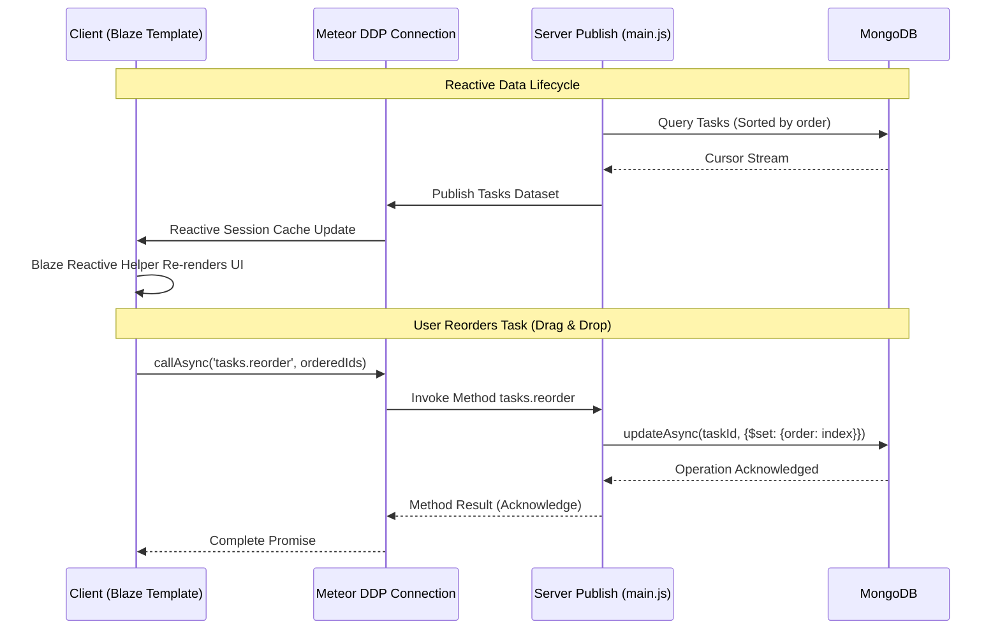

# ⚡ TaskFlow — Premium Meteor Blaze To-Do App

<div align="center">

[](https://meteor.com)
[](https://blazejs.org)
[](https://rspack.dev)
[](https://mongodb.com)

**TaskFlow** is an ultra-premium task management application designed to showcase modern web capabilities with the **Meteor 3.x** framework and the **Blaze** templating engine. Utilizing sleek dark-mode glassmorphism, responsive sidebar navigation, and a robust real-time reactive architecture, TaskFlow elevates a standard to-do checklist into a high-performance productivity board.

</div>

---

## 📖 Table of Contents
1. [🎨 Visual Preview](#-visual-preview)
2. [🌟 Key Features](#-key-features)
   - [Reactive Task Categories](#-reactive-task-categories)
   - [Persisted Drag-and-Drop Reordering](#-persisted-drag-and-drop-reordering)
   - [Inline Text Editing](#-inline-text-editing)
   - [Interactive Progress Tracking](#-interactive-progress-tracking)
3. [🏗️ Technical Architecture & Design Decisions](#%EF%B8%8F-technical-architecture--design-decisions)
   - [Meteor 3.x Async Engine](#meteor-3x-async-engine)
   - [Rspack Compiler Setup](#rspack-compiler-setup)
   - [Reactivity Model](#reactivity-model)
4. [📂 Project Structure](#-project-structure)
5. [🚀 Getting Started](#-getting-started)
6. [🛠️ Quality & Verification](#%EF%B8%8F-quality--verification)

---

## 🎨 Visual Preview

### 🖥️ Main Dashboard (Empty State)
A polished custom onboarding screen guides users to create their first task.


### 📋 Active Todo Board (Glassmorphic Interface)
A responsive sidebar groups filters and tracks overall completion metrics, while the main panel details categorizations and offers edit hooks.


---

## 🌟 Key Features

### 💼 Reactive Task Categories
- **Categorizations**: Work 💼, Personal 🏠, Urgent 🔥, and Other 📌.
- **Visual Color Systems**: Unique category identification using CSS HSL variables for color-coded borders and custom badge pills.
- **Reactive Count Badges**: Every category badge in the sidebar dynamically counts incomplete items in real time.

### 🫳 Persisted Drag-and-Drop Reordering
- **SortableJS Integration**: Smooth visual reordering with 150ms animation timing.
- **Drag Handles**: Left-aligned drag grabbers (`drag-handle`) ensure zero layout shifting.
- **Order Persistence**: Reordering updates the `order` fields in MongoDB via Meteor async methods.

### 📝 Inline Text Editing
- Double-click any task label to transform it into a live text field.
- Full keyboard listener integration: Press `Enter` to commit, or `Escape` to discard changes.

### 📊 Interactive Progress Tracking
- A dynamic SVG circle widget in the sidebar footer computes and renders task completion percentages.

---

## 🏗️ Technical Architecture & Design Decisions

### Meteor 3.x Async Engine
This application is fully compliant with Meteor 3.x's asynchronous guidelines. Sync methods (`findOne`, `insert`, `update`, `remove`) are replaced with their async counterparts:
```javascript
// Example async MongoDB operation on the server (imports/api/tasks/methods.js)
const maxOrderTask = await Tasks.findOneAsync({}, { sort: { order: -1 } });
const nextOrder = maxOrderTask ? maxOrderTask.order + 1 : 0;

await Tasks.insertAsync({
  text: text.trim(),
  checked: false,
  category: safeCategory,
  order: nextOrder,
  createdAt: new Date(),
});
```

### Rspack Compiler Setup
By utilizing Rspack as a lightning-fast build tool, this app gains incredible compilation speed. Rspack requires strict dependencies:
*   HTML templates (`App.html`, `Task.html`) are explicitly imported at the top of component JS files.
*   Spaces inside Spacebars templates are handled properly to avoid rendering bottlenecks.

### Reactivity Model (DDP Data Flow)


---

## 📂 Project Structure

```
mergerware-meteor-blaze-todo-app/
│
├── client/
│   ├── main.js             # Bootstraps Blaze & mounts root templates
│   ├── main.html           # Base document layout & HTML header
│   ├── main.css            # Dark mode design tokens & layouts
│   ├── App.html            # Sidebar navigation & task board container
│   ├── App.js              # Sidebar logic, list filtering & SortableJS bindings
│   ├── Task.html           # Task item UI template
│   ├── Task.js             # In-place editing, checkbox toggles & deletes
│   └── assets/             # Project screenshots & visual assets
│
├── imports/
│   └── api/tasks/
│       ├── tasks.js        # MongoDB Collection declaration & Categories configuration
│       └── methods.js      # Meteor 3.x async collection methods
│
└── server/
    └── main.js             # Meteor publications & startup callbacks
```

---

## 🚀 Getting Started

### Prerequisites
Make sure you have Node.js and Meteor installed on your machine.

```bash
# Verify Meteor installation
meteor --version
```

### Installation
1. Clone the repository:
   ```bash
   git clone https://github.com/ChigurupatiVenkatSaiKiran/mergerware-meteor-blaze-todo-app.git
   cd mergerware-meteor-blaze-todo-app
   ```
2. Install dependencies:
   ```bash
   npm install
   ```

### Running Locally
Start the Meteor dev server:
```bash
npm start
```
The server will boot up:
- **Application Endpoint**: `http://localhost:3000`
- **Rspack HMR Dev Server**: `http://localhost:8080`

---

## 🛠️ Quality & Verification

- **Zero Sync Exceptions**: Fully migrated to the async Mongo API to ensure zero thread bottlenecks on the server.
- **Client-Side Sanitization**: Input validation sanitizes task text before server insertion.
- **Responsive Layout**: Works on mobile, tablet, and widescreen layouts.
