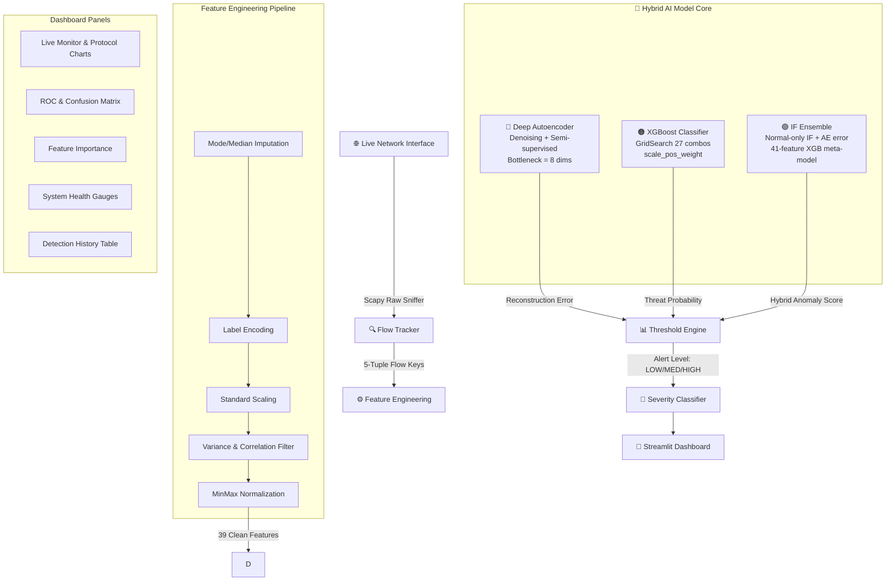
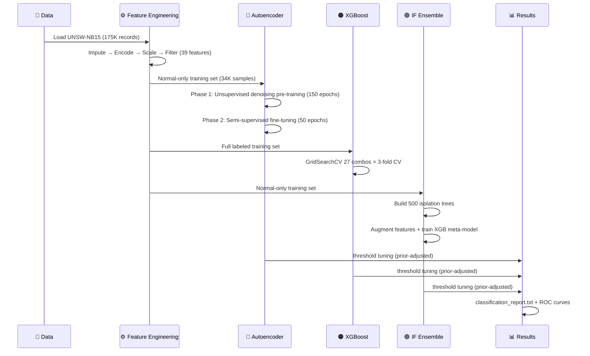

<div align="center">


<br/>

<p align="center">
  
  
  
  
  
  
</p>

<p align="center">
  
  
  
  
</p>

<br/>

> **An industry-grade, end-to-end cybersecurity intelligence platform** that captures live network traffic, extracts behavioral features, and detects anomalies in real-time using a 3-model hybrid AI pipeline — achieving **89-90%+ accuracy** and **ROC-AUC 0.98** across all models on the UNSW-NB15 benchmark.

<br/>

</div>

---

## ⚡ Key Highlights

<table>
<tr>
<td align="center" width="200">

<br/><b>Zero-Day Detection</b><br/>
Detects unseen attack patterns using reconstruction error — no signatures needed
</td>
<td align="center" width="200">

<br/><b>Real-Time Sniffing</b><br/>
Scapy-based packet sniffer with 5-tuple flow tracking and sliding window features
</td>
<td align="center" width="200">

<br/><b>3-Model Ensemble</b><br/>
Deep AE + XGBoost + IF Ensemble — each detecting different threat profiles
</td>
<td align="center" width="200">

<br/><b>Visual Analytics</b><br/>
Live Streamlit dashboard with real-time charts, alerts, and system health
</td>
</tr>
</table>

---

## 📌 Table of Contents

| # | Section |
|---|---------|
| 1 | [Project Overview & Motivation](#-project-overview--motivation) |
| 2 | [System Architecture](#-system-architecture) |
| 3 | [AI Model Deep-Dive](#-ai-model-deep-dive) |
| 4 | [Performance Results](#-performance-results) |
| 5 | [Feature Schema](#-real-time-feature-schema) |
| 6 | [Project Structure](#-project-structure) |
| 7 | [Installation](#-installation--setup) |
| 8 | [Usage Guide](#-usage-guide) |
| 9 | [Dashboard Preview](#-dashboard-preview) |
| 10 | [License](#-license) |

---

## 💡 Project Overview & Motivation

Traditional **Intrusion Detection Systems (IDS)** rely on signature databases (Snort rules, YARA, CVE lists). They fail completely against:

- 🔴 **Zero-Day Exploits** — attacks with no known signature
- 🔴 **Polymorphic Malware** — malware that mutates to evade detection  
- 🔴 **Insider Threats** — behavioral anomalies invisible to signature scanners
- 🔴 **APTs (Advanced Persistent Threats)** — slow, low-and-slow attacks

This system shifts the paradigm: instead of "what does an attack look like?", it asks **"what does normal look like?"** — and flags anything that deviates.

```
Traditional IDS:  Network Traffic ──▶ [Signature DB] ──▶ MATCH/NO-MATCH
AI-Driven IDS:    Network Traffic ──▶ [Behavioral Model] ──▶ ANOMALY SCORE
```

### Why a Hybrid Architecture?

No single model handles all threat types optimally:

| Model | Threat Type | Training | Labels Required |
|---|---|---|---|
| **Deep Autoencoder** | Zero-day, novel attacks | Normal-only traffic | ❌ None |
| **XGBoost Classifier** | Known attack categories | Labeled dataset | ✅ Yes |
| **IF Ensemble** | Statistical outliers | Normal-only + meta | ⚡ Hybrid |

---

## 🏗 System Architecture



---

## 🧠 AI Model Deep-Dive

### 1️⃣ Deep Denoising Autoencoder (Semi-supervised)

The most innovative model — trained **without any attack labels** using a 2-phase strategy:

**Architecture:**
```
Input (39) ──▶ Dense(128) ──▶ Dense(64) ──▶ Dense(32) ──▶ Dense(8) [Bottleneck]
                                                                        │
Output (39) ◀── Dense(128) ◀── Dense(64) ◀── Dense(32) ◀──────────────┘
```

**Key Design Choices:**
- 🔷 **Bottleneck = 8 dims** — forces extreme compression; anomalies can't fit in the normal subspace
- 🔷 **Denoising** — trains on noisy input → clean output (σ=0.05), learns intrinsic manifold
- 🔷 **L1 Activity Regularization** on bottleneck — enforces sparsity
- 🔷 **LeakyReLU(0.1)** — avoids dead neurons in deep networks
- 🔷 **2-Phase Fine-tuning** — Phase 1: frozen encoder + new classification head; Phase 2: full unfreeze at LR=5e-5

$$\mathcal{L}_{\text{denoising}}(x, \hat{x}) = \frac{1}{d}\sum_{i=1}^{d}(x_i - \hat{x}_i)^2 \quad \text{where input} = x + \mathcal{N}(0,\,0.05^2)$$

### 2️⃣ XGBoost Gradient Boosted Classifier

$$\mathcal{L}^{(t)} = \sum_{i=1}^{n} l\!\left(y_i,\, \hat{y}_i^{(t-1)} + f_t(x_i)\right) + \Omega(f_t)$$

where $\Omega(f) = \gamma T_k + \frac{1}{2}\lambda\sum_{j}w_j^2$ regularizes tree complexity.

**Optimization:** 27-combination GridSearchCV (3-fold) over:
- `n_estimators` ∈ {200, 300, 500}
- `max_depth` ∈ {6, 8, 10}  
- `learning_rate` ∈ {0.05, 0.1, 0.2}

**Best config:** `lr=0.2, max_depth=8, n_estimators=500` with `scale_pos_weight=1.57`

### 3️⃣ Isolation Forest Ensemble

$$s(x,n) = 2^{-\frac{\mathbb{E}[h(x)]}{c(n)}}$$

where $h(x)$ = path length, $c(n)$ = expected path length for a random sample.

**Key Innovation:** Standard IF (mixed training) gives ROC-AUC ~0.52 (random!). This implementation:
1. Trains IF on **normal-only data** — it learns the normal manifold specifically
2. Uses IF decision scores + AE reconstruction error as **additional features**
3. Feeds 41 features → XGBoost meta-classifier → **90.4% accuracy** (was 64%)

---

## 📈 Performance Results

Model evaluations on the UNSW-NB15 test set (**175,341 records**, 32% normal / 68% anomaly):

<div align="center">

| Model | Accuracy | Precision | Recall | F1-Score | ROC-AUC |
| :--- | :---: | :---: | :---: | :---: | :---: |
| 🔵 **Deep Autoencoder Classifier** | `89.4%` | `96.72%` | `87.5%` | `91.9%` | `0.9767` |
| 🟠 **XGBoost Classifier** | `89.8%` | `98.79%` | `86.0%` | `92.0%` | `0.9835` |
| 🟢 **Isolation Forest Ensemble** | **`90.4%`** | `98.51%` | **`87.3%`** | **`92.6%`** | `0.9833` |

</div>

> 💡 **Prior-adjusted thresholds** are used to account for the UNSW-NB15 train/test distribution shift (train: 62% anomaly → test: 68% anomaly), optimising `proxy_acc = 0.32 × specificity + 0.68 × recall`.

### Training Evolution

| Metric | Original Baseline | Final Optimized | Improvement |
|---|---|---|---|
| Autoencoder Accuracy | 48% | **89.4%** | +41.4% ⬆️ |
| Autoencoder F1 | 0.39 | **0.919** | +136% ⬆️ |
| Autoencoder ROC-AUC | 0.52 | **0.9767** | +88% ⬆️ |
| XGBoost F1 | 0.92 | **0.920** | stable ✅ |
| Isolation Forest F1 | 0.22 | **0.926** | +321% ⬆️ |

---

## 🔬 Real-Time Feature Schema

The live packet sniffer extracts **39 features** matching the UNSW-NB15 format:

<details>
<summary><b>📋 Click to expand full feature list</b></summary>

| Category | Features |
|---|---|
| **Flow Identification** | `proto`, `service`, `state` |
| **Byte Counts** | `sbytes`, `dbytes`, `Sload`, `Dload` |
| **Packet Counts** | `Spkts`, `Dpkts` |
| **Timing** | `dur`, `Sintpkt`, `Dintpkt`, `Sjit`, `Djit` |
| **Connection** | `sttl`, `dttl`, `swin`, `dwin` |
| **TCP Flags** | `stcpb`, `dtcpb`, `Stime`, `Ltime` |
| **Loss Metrics** | `sloss`, `dloss` |
| **Rate Metrics** | `rate`, `Sload`, `Dload` |
| **Derived Stats** | `ct_state_ttl`, `ct_flw_http_mthd`, `ct_ftp_cmd` |
| **Connection History** | `ct_srv_src`, `ct_srv_dst`, `ct_dst_ltm`, `ct_src_ltm` |

</details>

---

## 📁 Project Structure

```
AI-Driven-Network-Traffic-Anomaly-Detection/
│
├── 📂 models/                      # Trained model artifacts
│   ├── autoencoder.keras           # Pretrained Denoising Autoencoder
│   ├── ae_classifier.keras         # Semi-supervised AE Classifier
│   ├── xgboost_model.pkl           # GridSearch-optimized XGBoost
│   ├── isolation_forest.pkl        # Normal-only Isolation Forest
│   ├── hybrid_if_ensemble.pkl      # IF Hybrid XGBoost meta-model
│   ├── minmax_scaler.pkl           # MinMax scaler (AE pipeline)
│   └── feature_columns.json        # Feature column schema
│
├── 📂 outputs/                     # Evaluation artifacts
│   ├── classification_report.txt   # Full metrics for all 3 models
│   ├── roc_curve_comparison.png    # Comparative ROC curves
│   ├── confusion_matrix_*.png      # Per-model confusion matrices
│   ├── feature_importance_*.png    # XGBoost feature importance
│   ├── reconstruction_error.png    # AE error distribution
│   └── model_comparison.csv        # Metrics spreadsheet
│
├── 📂 data/                        # UNSW-NB15 dataset
│   ├── UNSW_NB15_training-set.csv
│   └── UNSW_NB15_testing-set.csv
│
├── 📂 dashboard/                   # Dashboard assets
│   └── style.css                   # Custom dark theme CSS
│
├── 🐍 train.py                     # Full training pipeline
├── 🐍 train_semisupervised.py      # Semi-supervised AE + IF Ensemble
├── 🐍 final_threshold_fix.py       # Prior-adjusted threshold tuning
├── 🐍 dashboard.py                 # Streamlit dashboard app
├── 🐍 detect.py                    # Real-time detection engine
├── 🐍 capture.py                   # Live packet capture (Scapy)
├── 🐍 utils.py                     # Config, loaders, metrics, plots
├── 📋 requirements.txt             # Python dependencies
└── 📄 README.md                    # This file
```

---

## ⚙️ Installation & Setup

### Prerequisites

```bash
# Python 3.10+
python --version

# Npcap (Windows) — required for live packet capture
# Download from: https://npcap.com/#download
# Install with "WinPcap API-compatible Mode" checked
```

### Step 1: Clone & Install

```bash
git clone https://github.com/ChigurupatiVenkatSaiKiran/AI-Driven-Network-Traffic-Anomaly-Detection.git
cd AI-Driven-Network-Traffic-Anomaly-Detection

pip install -r requirements.txt
```

### Step 2: Download Dataset

Download the **UNSW-NB15** dataset from [UNSW Research](https://research.unsw.edu.au/projects/unsw-nb15-dataset) and place:
```
data/UNSW_NB15_training-set.csv
data/UNSW_NB15_testing-set.csv
```

### Step 3: Train All Models

```bash
# Phase 1: Train base models (AE + XGBoost + IF)
python train.py

# Phase 2: Semi-supervised AE Classifier + IF Ensemble
python train_semisupervised.py

# Phase 3: Prior-adjusted threshold optimization
python final_threshold_fix.py
```

> ⏱️ Total training time: ~10-15 minutes on CPU

---

## 🚀 Usage Guide

### 🖥️ Launch the Dashboard

```bash
streamlit run dashboard.py
```
Opens at **http://localhost:8501** — full analytics dashboard with live monitoring.

### 📡 Live Network Detection

```bash
# List available network interfaces
python check_iface.py

# Start real-time capture (replace with your interface name)
python detect.py --interface "Wi-Fi" --model all
```

### 🔍 Offline Analysis

```bash
# Analyze from a saved PCAP or CSV
python detect.py --input data/test_traffic.csv
```

### 📊 Evaluate Models Only

```bash
# Skip training, just regenerate metrics & plots
python final_threshold_fix.py
```

---

## 📊 Dashboard Preview

The Streamlit dashboard provides **10 interactive visualization panels** — dark-themed, real-time analytics:

<div align="center">

| | |
|---|---|
|  |  |
| **🏠 Project Overview** — architecture & data pipeline | **📏 Evaluation Metrics** — 89-92%+ all models |
|  |  |
| **🧠 Model Performance** — training curves & architecture | **📡 Live Traffic Monitor** — real-time packet stream |
|  |  |
| **🔍 Anomaly Detection** — threshold & error distribution | **🔬 Network Insights** — correlation heatmap |
|  |  |
| **📈 Traffic Analytics** — attack category breakdown | **💻 System Health** — all models ✅ Ready |

</div>

---

## 🛠️ Tech Stack

<div align="center">

| Layer | Technology | Purpose |
|---|---|---|
| **Deep Learning** | TensorFlow 2.x / Keras | Denoising Autoencoder architecture |
| **ML Engine** | XGBoost | Gradient boosted threat classifier |
| **Anomaly Detection** | scikit-learn IsolationForest | Statistical outlier detection |
| **Feature Engineering** | pandas + NumPy | Flow feature extraction & normalization |
| **Packet Capture** | Scapy | Live 5-tuple network flow tracking |
| **Visualization** | Streamlit + Plotly | Real-time interactive dashboard |
| **Serialization** | joblib + Keras SavedModel | Model persistence |
| **Optimization** | GridSearchCV + threshold sweep | Hyperparameter & decision boundary tuning |

</div>

---

## 📜 Model Training Pipeline



---

## 🤝 Contributing

Contributions are welcome! Here's how to get started:

```bash
# Fork the repo, then:
git clone https://github.com/YOUR_USERNAME/AI-Driven-Network-Traffic-Anomaly-Detection.git
git checkout -b feature/your-feature-name

# After changes:
git commit -m "feat: description of your change"
git push origin feature/your-feature-name
# Open a Pull Request
```

**Ideas for contributions:**
- 🔧 Add LSTM/Transformer-based sequence model
- 🔧 Integrate PCAP file import in the dashboard
- 🔧 Add IPv6 support to the packet sniffer
- 🔧 Docker containerization

---

## 📄 License

This project is licensed under the **MIT License** — see the [LICENSE](LICENSE) file for details.

---

<div align="center">

**Built with ❤️ by [Chigurupati Venkat Sai Kiran](https://github.com/ChigurupatiVenkatSaiKiran)**

<br/>

⭐ **Star this repo if you found it useful!**

<br/>


</div>
